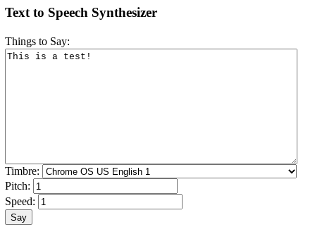

TextToSpeechSynthesizer
=======================

A frontend for the HTML5 Web Speech API.

To see it in action, open Source/TextToSpeechSynthesizer.html in a web
browser that runs JavaScript.  The web browser must also supply some
valid "voices" to choose from; not all browsers do, however.

 
